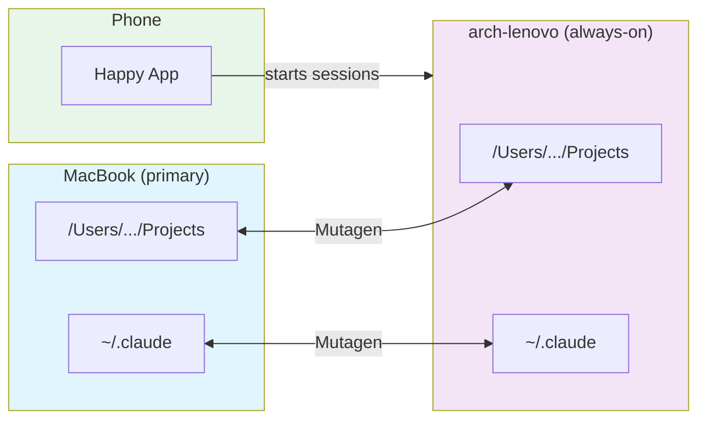
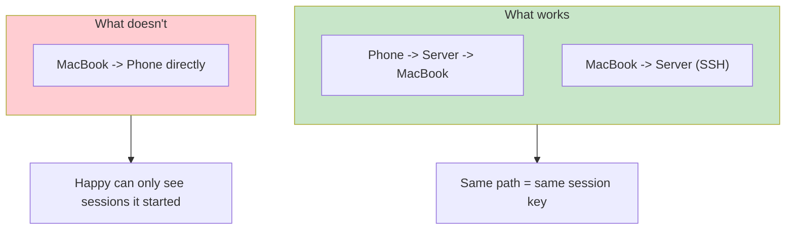
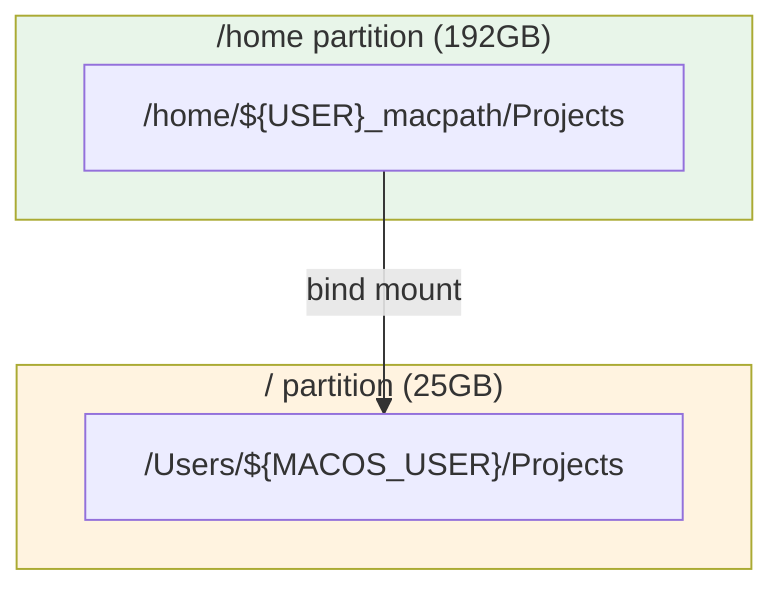

# Always-On Claude

> **v1** - This setup works but has rough edges. See "Mistakes we made" below.

> **Excited about [Happier](https://github.com/happier-dev/happier)!** The Happy app isn't actively maintained, but Leroy is building a fork with many improvements. I'll switch to that once it's released.

Sync two machines so Claude sessions work from anywhere - your laptop, a home server, or your phone.



## How it works

1. **Tailscale** creates a secure mesh network between devices
2. **Mutagen** syncs `~/Projects` and `~/.claude` bidirectionally
3. **Bind mount** on Linux makes paths identical (`/Users/<username>/...` on both machines)
4. **Happy CLI** lets you start Claude sessions from your phone

The bind mount is the trick. Claude stores sessions by path - if paths match, sessions are portable.

> **Note:** `arch-lenovo` is just the hostname of my server - replace with your own machine's hostname throughout.

## Session portability



| Scenario | Works? | Why |
|----------|--------|-----|
| Start on phone, continue on laptop | Yes | Happy creates session at `/Users/...`, Mutagen syncs it |
| Start on laptop, continue via SSH | Yes | Same paths on both machines |
| Start on laptop, continue on phone | No | Happy can't see sessions it didn't start |

## The bind mount

Linux doesn't have `/Users`. We create it, but store the data on the big partition:



A symlink won't work - programs resolve symlinks and see `/home/...`. A bind mount makes the directory appear real at `/Users/...`.

## Quick reference

```bash
# Check sync status
mutagen sync list

# SSH to server
ssh arch-lenovo          # local network
ssh arch-lenovo-ts       # via Tailscale

# Start session from phone
# Just use Happy app - sessions appear automatically
```

## Sync safety

**Pause sync before changing paths:**

```bash
mutagen sync pause projects
mutagen sync pause claude-config
# make changes
mutagen sync resume projects
mutagen sync resume claude-config
```

Moving directories while sync runs will break things.

## What syncs

| Path | Synced | Notes |
|------|--------|-------|
| ~/Projects | Yes | Excludes node_modules, .venv, build artifacts |
| ~/.claude | Yes | Conversations, plugins, skills |
| ~/.claude/CLAUDE.md | No | Machine-specific |

## Setup

### Server (Arch Linux)

```bash
# Install and enable services
sudo pacman -S tailscale openssh
sudo systemctl enable --now sshd tailscaled
sudo tailscale up

# Create bind mount for path compatibility
# MACOS_USER = your macOS username (run `whoami` on MacBook to check)
MACOS_USER="yourname"  # <-- change this!
sudo mkdir -p /home/${USER}_macpath/Projects
sudo mkdir -p /Users/${MACOS_USER}
sudo mount --bind /home/${USER}_macpath /Users/${MACOS_USER}
echo "/home/${USER}_macpath /Users/${MACOS_USER} none bind 0 0" | sudo tee -a /etc/fstab

# Install Claude Code via nvm (not system node)
curl -o- https://raw.githubusercontent.com/nvm-sh/nvm/v0.39.0/install.sh | bash
nvm install 22
npm install -g @anthropic-ai/claude-code happy-coder
```

### Client (macOS)

```bash
# Install Mutagen
brew install mutagen-io/mutagen/mutagen
mutagen daemon start

# Initial transfer (do this BEFORE enabling sync)
# ~/Projects is your MacBook path, server uses /Users/... (the bind mount)
scp -r ~/Projects/* arch-lenovo:/Users/$USER/Projects/

# Create syncs (MacBook ~/Projects <-> Server /Users/.../Projects)
mutagen sync create --name=projects --mode=two-way-safe \
  --ignore="node_modules" --ignore=".venv" --ignore="dist" \
  --ignore="build" --ignore=".next" --ignore=".cache" \
  ~/Projects arch-lenovo:/Users/$USER/Projects

mutagen sync create --name=claude-config --mode=two-way-safe \
  --ignore="CLAUDE.md" \
  ~/.claude arch-lenovo:~/.claude
```

## Troubleshooting

**Sync stuck:** `mutagen sync terminate projects` then recreate

**Conflicts:** `mutagen sync list` shows them - pick a side and delete the other

**Can't connect:** Check `tailscale status`, try `ping arch-lenovo`

**Missing deps after sync:** node_modules and .venv don't sync - rebuild locally

## Mistakes we made

1. **Moved directories while sync was running** - Claude session crashed, Mutagen errored
2. **Put /Users on root partition** - filled up 25GB fast, should've used /home
3. **Used symlink instead of bind mount** - Happy showed wrong paths, sessions weren't portable
4. **Forgot to clean old laptop** - 12GB movie, 3.5GB pacman cache ate disk space

## Context

This repurposes a 2020 ThinkPad running Arch Linux. It's not a cloud VM or purpose-built server. The partition layout (25GB root, 192GB home) caused headaches until we figured out the bind mount approach.

Happy CLI is lightly maintained. It can't list sessions it didn't start, so laptop-to-phone handoff doesn't work yet.

## Alternatives

If this sounds like too much trouble: DigitalOcean ($6/mo), Hetzner, or Oracle Cloud Free Tier. Fresh system, no partition surprises. But this costs nothing and keeps data local.
