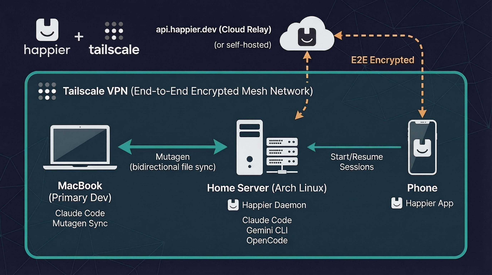
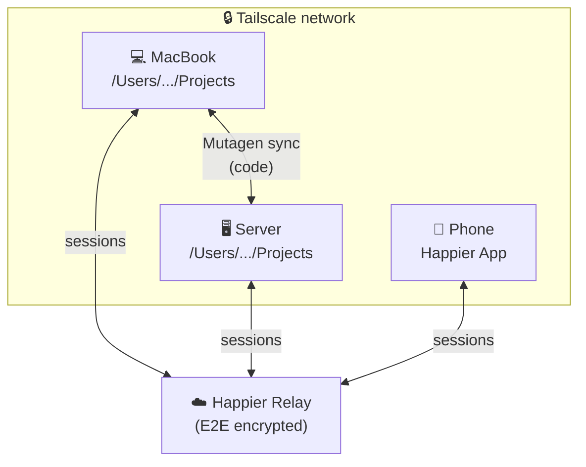
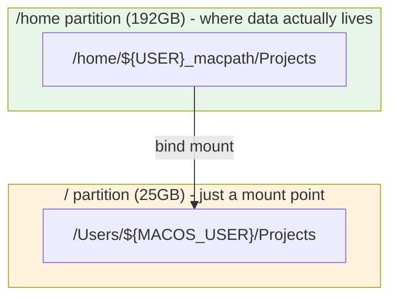

# Always-On Claude

> **Now using [Happier](https://github.com/happier-dev/happier)!** This project previously used [Happy](https://github.com/happycoder/happy) as its session management CLI. Happy is no longer actively maintained — we've migrated to Happier, a fork with multi-backend support (Claude, Gemini, OpenCode, and more), cloud relay, and active development. For the original Happy-based setup, check out tag [`v1.0-happy`](../../tree/v1.0-happy).

> **Take:** Clawdbot/Moltbot/OpenClaw aren't for me *yet*. I prefer an interface where I manage multiple threads rather than a single gateway agent managing them for me - visibility and control matter. That said, I get the vision: future models will be capable enough that delegating to one very good orchestrator agent will just work. We're not quite there, but getting close. For now, Happier fills the gap perfectly - I stay in control while still getting multi-backend flexibility.



Sync your code and conversations between machines. Start Claude sessions from anywhere - your laptop, a home server, or your phone.

## Overview

**Devices:**
- MacBook (primary dev machine)
- iPhone (for on-the-go access)
- Server - I use an old Lenovo ThinkPad running Arch, but you could use a DigitalOcean Droplet, Hetzner VM, or whatever

**Tools:**
- [Claude Code](https://github.com/anthropics/claude-code) - Claude in the terminal
- [Happier CLI](https://github.com/happier-dev/happier) - manage AI coding sessions from your phone (Claude, Gemini, OpenCode, and more)
- [Mutagen](https://mutagen.io/) - bidirectional file syncing
- [Tailscale](https://tailscale.com/) - secure mesh network tying everything together (SSH, port forwarding, etc.)

## Context

This repurposes a 2020 ThinkPad running Arch Linux as a home server. It's not a cloud VM or purpose-built server. Every machine is different - partition layouts, usernames, network configs. This guide documents the core concepts; adapt to your setup.

**Want to set this up?** Point Claude to this repo - it includes skills that can help. But expect to adapt things to your specific machine.


```mermaid
flowchart TB
    subgraph Tailscale["🔒 Tailscale network"]
        direction LR

        MacBook["💻 MacBook<br/>/Users/.../Projects"]
        Server["🖥️ Server<br/>/Users/.../Projects"]
        Phone["📱 Phone<br/>Happier App"]

        MacBook <-->|"Mutagen sync<br/>(code)"| Server
    end

    Relay["☁️ Happier Relay<br/>(E2E encrypted)"]

    MacBook <-->|"sessions"| Relay
    Server <-->|"sessions"| Relay
    Phone <-->|"sessions"| Relay
```

## How it works

1. **Tailscale** creates a secure mesh network between devices
2. **Mutagen** syncs `~/Projects` bidirectionally (code files)
3. **Bind mount** on Linux makes paths identical across machines
4. **Happier CLI** manages sessions from any device — daemon on both machines + cloud relay keeps conversations in sync

## Cross-device sessions

### Why the relay matters

In v1/v2, conversations lived as `.jsonl` files on whichever machine ran the session. To continue a conversation on another device, you had to physically transfer those files (via Mutagen sync or manual SCP). This was fragile — race conditions, stale state, merge conflicts.

Happier's relay changes this fundamentally. The relay server maintains conversation state in a Postgres database, and devices communicate via a socket.io protocol with E2E encryption. When you start a session on your server, the relay holds the running state. Any authenticated device can connect to that session through the relay — your phone, your laptop, another server — without needing the `.jsonl` files locally. The conversation history lives in the relay, not on disk.

This is the key insight that made v3 possible: **we don't need to sync conversation files between machines anymore.** Mutagen handles code, the relay handles conversations. Each tool does one job.

### What works today

With Happier daemon running on both your server and MacBook, conversations sync through the relay server:

| Scenario | Works? |
|----------|--------|
| Start on phone, continue on laptop | ✅ (via Happier app/web) |
| Start on laptop, continue on server | ✅ (via relay) |
| See all sessions from any device | ✅ |

```bash
happier session list              # see all sessions from any device
happier resume                    # interactive session picker
happier resume <session-id>       # resume specific session
```

## The bind mount

My ThinkPad was set up as a personal computer, not a server. The root partition (`/`) is only 25GB while `/home` has 192GB. Be careful mounting things to root - you'll run out of space.

**Solution:** Store data on the big partition, bind mount to create the `/Users/...` path:


```mermaid
flowchart TB
    subgraph home["/home partition (192GB) - where data actually lives"]
        DATA["/home/${USER}_macpath/Projects"]
    end

    subgraph root["/ partition (25GB) - just a mount point"]
        MOUNT["/Users/${MACOS_USER}/Projects"]
    end

    DATA -->|"bind mount"| MOUNT

    style home fill:#e8f5e9
    style root fill:#fff3e0
```

**Where's the data?** Actually stored in `/home/${USER}_macpath/`. The bind mount makes it *appear* at `/Users/...` so paths match macOS.

**Why not a symlink?** Programs resolve symlinks and see `/home/...`. A bind mount makes the directory appear real at `/Users/...` - Claude sees the same path on both machines.

## Quick reference

```bash
# Check sync status
mutagen sync list

# SSH to server
ssh arch-lenovo          # local network
ssh arch-lenovo-ts       # via Tailscale

# Start session from phone
# Just use Happier app - sessions appear automatically
```

## Sync safety

> **⚠️ Mutagen sync should be opt-in.** Bidirectional file syncing carries real risk of data loss on your primary machine. If Mutagen gets confused (conflicts, race conditions, interrupted transfers), it can delete or overwrite files on either side. The `two-way-safe` mode helps but isn't bulletproof. **Understand the risks before enabling sync, and always keep backups of important work.** If you're not comfortable with this, skip Mutagen and use `git push`/`pull` or manual `scp` instead.

**Pause sync before changing paths:**

```bash
mutagen sync pause projects
# make changes
mutagen sync resume projects
```

Moving directories while sync runs will break things.

## What syncs

| What | Synced | How |
|------|--------|-----|
| ~/Projects | ✅ | Mutagen (excludes node_modules, .venv, build artifacts) |
| Conversations | ✅ | Happier relay (E2E encrypted, accessible from any device) |
| ~/.claude/CLAUDE.md | ❌ | Machine-specific config, intentionally separate |

See [`examples/CLAUDE.md.example`](examples/CLAUDE.md.example) for a sample server CLAUDE.md with machine context, sync safety rules, and workflow reminders.

## Setup

### Server (Arch Linux)

```bash
# Install and enable services
sudo pacman -S tailscale openssh
sudo systemctl enable --now sshd tailscaled
sudo tailscale up

# Create bind mount for path compatibility
# MACOS_USER = your macOS username (run `whoami` on MacBook to check)
MACOS_USER="yourname"  # <-- change this!
sudo mkdir -p /home/${USER}_macpath/Projects
sudo mkdir -p /Users/${MACOS_USER}
sudo mount --bind /home/${USER}_macpath /Users/${MACOS_USER}
echo "/home/${USER}_macpath /Users/${MACOS_USER} none bind 0 0" | sudo tee -a /etc/fstab

# Install Claude Code via nvm (not system node)
curl -o- https://raw.githubusercontent.com/nvm-sh/nvm/v0.39.0/install.sh | bash
nvm install 22
npm install -g @anthropic-ai/claude-code

# Install Happier CLI
# Note: the prebuilt binary needs AVX2. If your server is pre-2013 / Sandy Bridge
# or older, see happier-setup.md for a build-from-source path.
curl -fsSL https://happier.dev/install | bash
happier auth login
happier daemon install
```

### Client (macOS)

```bash
# Install Mutagen
brew install mutagen-io/mutagen/mutagen
mutagen daemon start

# Initial transfer (do this BEFORE enabling sync)
# ~/Projects is your MacBook path, server uses /Users/... (the bind mount)
scp -r ~/Projects/* arch-lenovo:/Users/$USER/Projects/

# Create sync (code only - NOT conversations)
mutagen sync create --name=projects --mode=two-way-safe \
  --ignore="node_modules" --ignore=".venv" --ignore="dist" \
  --ignore="build" --ignore=".next" --ignore=".cache" \
  ~/Projects arch-lenovo:/Users/$USER/Projects
```

### Happier CLI (on MacBook)

```bash
# Install Happier
curl -fsSL https://happier.dev/install | bash

# Authenticate (same account as server)
happier auth login

# Install daemon (enables cross-device session sync)
happier daemon install
```

## Tailscale tips

### File sharing between devices

Tailscale can send files directly between devices with `tailscale file cp`. This works with any device on your tailnet, including phones with the Tailscale app installed.

```bash
# By default, requires sudo. To fix this once:
sudo tailscale set --operator=$USER

# Then send files without sudo
tailscale file cp myfile.md phone-name:
tailscale file cp *.md phone-name:
```

### SSH access from phone

You can SSH into your server from your phone using apps like [Termius](https://termius.com/), connecting over the Tailscale network. This is useful for tasks Claude can't do on its own, like installing packages that require `sudo`:

```bash
# From Termius (or any SSH client), connect to:
# Host: your-server-tailscale-hostname (or Tailscale IP)
# User: your-username
```

### Passwordless sudo (optional, less secure)

If you want Claude (or scripts) to run `sudo` commands without a password prompt:

```bash
# On the server, create a sudoers drop-in:
echo "$USER ALL=(ALL:ALL) NOPASSWD: ALL" | sudo tee /etc/sudoers.d/$USER
```

This is convenient but means any process running as your user gets root access. It's up to your preference and threat model — on a home server behind Tailscale the risk is low, but be aware of the trade-off.

## Troubleshooting

**Sync stuck:** `mutagen sync terminate projects` then recreate

**Conflicts:** `mutagen sync list` shows them - pick a side and delete the other

**Can't connect:** Check `tailscale status`, try `ping arch-lenovo`

**Missing deps after sync:** node_modules and .venv don't sync - rebuild locally

## Mistakes we made

1. **Moved directories while sync was running** - Claude session crashed, Mutagen errored
2. **Put /Users on root partition** - filled up 25GB fast, should've used /home
3. **Used symlink instead of bind mount** - Happier showed wrong paths, sessions weren't portable
4. **Forgot to clean old laptop** - 12GB movie, 3.5GB pacman cache ate disk space

## Evolution

- **v1** (Happy CLI) — original setup, Happy is no longer maintained
- **v2** (Happier CLI) — migrated to Happier fork, documented session sync as a limitation. We tried syncing `~/.claude` via Mutagen to share JSONL session files between machines — this caused race conditions and was the root of most sync bugs.
- **v3** — realized Happier's relay server already solves session sync. Conversations are stored E2E encrypted in the relay's Postgres database and streamed via socket.io — no need to transfer JSONL files between machines. Removed the `~/.claude` Mutagen sync and the manual `conversation-transfer` skill. See [issue #1](../../issues/1) for the original investigation.

## Alternatives

If this sounds like too much trouble: DigitalOcean ($6/mo), Hetzner, or Oracle Cloud Free Tier. Fresh system, no partition surprises. But this costs nothing and keeps data local.
