# Always-On Claude (v1)

> **Excited about [Happier](https://github.com/happier-dev/happier)!** The Happy app isn't actively maintained, but [@leeroy](https://github.com/leeroy) is building a fork with many improvements. I'll switch to that once it's released.

> **Take:** Clawdbot/Moltbot/OpenClaw aren't for me. I prefer an interface where I manage multiple threads rather than an agent managing them for me - visibility and control matter. Happy fills that gap, and Happier will be even better.

Sync two machines so Claude sessions work from anywhere - your laptop, a home server, or your phone.

## Overview

**Devices:**
- MacBook (primary dev machine)
- iPhone (for on-the-go access)
- Server - I use an old Lenovo ThinkPad running Arch, but you could use a DigitalOcean Droplet, Hetzner VM, or whatever

**Tools:**
- [Claude Code](https://github.com/anthropics/claude-code) - Claude in the terminal
- [Happy CLI](https://github.com/happycoder/happy) - manage Claude sessions from your phone
- [Mutagen](https://mutagen.io/) - bidirectional file syncing
- [Tailscale](https://tailscale.com/) - secure mesh network tying everything together (SSH, port forwarding, etc.)

## Context

This repurposes a 2020 ThinkPad running Arch Linux as a home server. It's not a cloud VM or purpose-built server. Every machine is different - partition layouts, usernames, network configs. This guide documents the core concepts; adapt to your setup.

**Want to set this up?** Point Claude to this repo - it includes skills that can help. But expect to adapt things to your specific machine.

```mermaid
flowchart TB
    subgraph Tailscale["🔒 Tailscale network"]
        direction LR

        MacBook["💻 MacBook<br/>/Users/.../Projects<br/>~/.claude"]
        Server["🖥️ Server<br/>/Users/.../Projects<br/>~/.claude"]
        Phone["📱 Phone<br/>Happy App"]

        MacBook <-->|"Mutagen sync"| Server
        Phone -->|"starts sessions"| Server
    end
```



## How it works

1. **Tailscale** creates a secure mesh network between devices
2. **Mutagen** syncs `~/Projects` and `~/.claude` bidirectionally
3. **Bind mount** on Linux makes paths identical - so Claude conversations (stored in `~/.claude/projects/-Users-<username>-...`) use the same keys on both machines
4. **Happy CLI** lets you start Claude sessions from your phone

The bind mount is the trick. Claude stores conversations keyed by project path (e.g., `-Users-yourname-Projects-foo`). Same path on both machines = same conversation accessible from either.

## Session portability

- **Phone → Server → MacBook**: Works. Happy creates session at `/Users/...`, Mutagen syncs it, same path on MacBook.
- **MacBook → Server (SSH)**: Works. Same paths on both machines = same conversation keys.
- **MacBook → Phone**: Doesn't work. Happy can only see sessions it started.

**Note:** Even when you can't continue a conversation directly, the files always sync. You can start a new session and catch up - Claude will see all your code changes.

## The bind mount

My ThinkPad was set up as a personal computer, not a server. The root partition (`/`) is only 25GB while `/home` has 192GB. Be careful mounting things to root - you'll run out of space.

**Solution:** Store data on the big partition, bind mount to create the `/Users/...` path:


**Where's the data?** Actually stored in `/home/${USER}_macpath/`. The bind mount makes it *appear* at `/Users/...` so paths match macOS.

**Why not a symlink?** Programs resolve symlinks and see `/home/...`. A bind mount makes the directory appear real at `/Users/...` - Claude sees the same path on both machines.

## Quick reference

```bash
# Check sync status
mutagen sync list

# SSH to server
ssh arch-lenovo          # local network
ssh arch-lenovo-ts       # via Tailscale

# Start session from phone
# Just use Happy app - sessions appear automatically
```

## Sync safety

**Pause sync before changing paths:**

```bash
mutagen sync pause projects
mutagen sync pause claude-config
# make changes
mutagen sync resume projects
mutagen sync resume claude-config
```

Moving directories while sync runs will break things.

## What syncs

| Path | Synced | Notes |
|------|--------|-------|
| ~/Projects | Yes | Excludes node_modules, .venv, build artifacts |
| ~/.claude | Yes | Conversations, plugins, skills |
| ~/.claude/CLAUDE.md | No | Machine-specific |

See [`examples/CLAUDE.md.example`](examples/CLAUDE.md.example) for a sample server CLAUDE.md with machine context, sync safety rules, and workflow reminders.

## Setup

### Server (Arch Linux)

```bash
# Install and enable services
sudo pacman -S tailscale openssh
sudo systemctl enable --now sshd tailscaled
sudo tailscale up

# Create bind mount for path compatibility
# MACOS_USER = your macOS username (run `whoami` on MacBook to check)
MACOS_USER="yourname"  # <-- change this!
sudo mkdir -p /home/${USER}_macpath/Projects
sudo mkdir -p /Users/${MACOS_USER}
sudo mount --bind /home/${USER}_macpath /Users/${MACOS_USER}
echo "/home/${USER}_macpath /Users/${MACOS_USER} none bind 0 0" | sudo tee -a /etc/fstab

# Install Claude Code via nvm (not system node)
curl -o- https://raw.githubusercontent.com/nvm-sh/nvm/v0.39.0/install.sh | bash
nvm install 22
npm install -g @anthropic-ai/claude-code happy-coder
```

### Client (macOS)

```bash
# Install Mutagen
brew install mutagen-io/mutagen/mutagen
mutagen daemon start

# Initial transfer (do this BEFORE enabling sync)
# ~/Projects is your MacBook path, server uses /Users/... (the bind mount)
scp -r ~/Projects/* arch-lenovo:/Users/$USER/Projects/

# Create syncs (MacBook ~/Projects <-> Server /Users/.../Projects)
mutagen sync create --name=projects --mode=two-way-safe \
  --ignore="node_modules" --ignore=".venv" --ignore="dist" \
  --ignore="build" --ignore=".next" --ignore=".cache" \
  ~/Projects arch-lenovo:/Users/$USER/Projects

mutagen sync create --name=claude-config --mode=two-way-safe \
  --ignore="CLAUDE.md" \
  ~/.claude arch-lenovo:~/.claude
```

## Troubleshooting

**Sync stuck:** `mutagen sync terminate projects` then recreate

**Conflicts:** `mutagen sync list` shows them - pick a side and delete the other

**Can't connect:** Check `tailscale status`, try `ping arch-lenovo`

**Missing deps after sync:** node_modules and .venv don't sync - rebuild locally

## Mistakes we made

1. **Moved directories while sync was running** - Claude session crashed, Mutagen errored
2. **Put /Users on root partition** - filled up 25GB fast, should've used /home
3. **Used symlink instead of bind mount** - Happy showed wrong paths, sessions weren't portable
4. **Forgot to clean old laptop** - 12GB movie, 3.5GB pacman cache ate disk space

## Alternatives

If this sounds like too much trouble: DigitalOcean ($6/mo), Hetzner, or Oracle Cloud Free Tier. Fresh system, no partition surprises. But this costs nothing and keeps data local.
