# Always-On Claude (v1)

> **Excited about [Happier](https://github.com/happier-dev/happier)!** The Happy app isn't actively maintained, but [@leeroy](https://github.com/leeroy) is building a fork with many improvements. I'll switch to that once it's released.

> **Take:** Clawdbot/Moltbot/OpenClaw aren't for me. I prefer an interface where I manage multiple threads rather than an agent managing them for me - visibility and control matter. Happy fills that gap, and Happier will be even better.

Sync your code between machines so you can start Claude sessions from anywhere - your laptop, a home server, or your phone.

> **⚠️ Sessions don't sync - only code does.**
>
> I originally wanted to continue conversations across machines. It doesn't work reliably. Claude Code writes to conversation files continuously, causing race conditions with bidirectional sync. After much debugging ([issue #1](../../issues/1)), I've accepted that **sessions are local to each machine**.
>
> What you get: Start a session on your phone, your code changes sync, continue working on your laptop with a *new* session that sees all your code. Not seamless, but practical.

## Overview

**Devices:**
- MacBook (primary dev machine)
- iPhone (for on-the-go access)
- Server - I use an old Lenovo ThinkPad running Arch, but you could use a DigitalOcean Droplet, Hetzner VM, or whatever

**Tools:**
- [Claude Code](https://github.com/anthropics/claude-code) - Claude in the terminal
- [Happy CLI](https://github.com/happycoder/happy) - manage Claude sessions from your phone
- [Mutagen](https://mutagen.io/) - bidirectional file syncing
- [Tailscale](https://tailscale.com/) - secure mesh network tying everything together (SSH, port forwarding, etc.)

## Context

This repurposes a 2020 ThinkPad running Arch Linux as a home server. It's not a cloud VM or purpose-built server. Every machine is different - partition layouts, usernames, network configs. This guide documents the core concepts; adapt to your setup.

**Want to set this up?** Point Claude to this repo - it includes skills that can help. But expect to adapt things to your specific machine.

```mermaid
flowchart TB
    subgraph Tailscale["🔒 Tailscale network"]
        direction LR

        MacBook["💻 MacBook<br/>/Users/.../Projects"]
        Server["🖥️ Server<br/>/Users/.../Projects"]
        Phone["📱 Phone<br/>Happy App"]

        MacBook <-->|"Mutagen sync<br/>(code only)"| Server
        Phone -->|"starts sessions"| Server
    end
```



## How it works

1. **Tailscale** creates a secure mesh network between devices
2. **Mutagen** syncs `~/Projects` bidirectionally (code, not conversations)
3. **Bind mount** on Linux makes paths identical across machines
4. **Happy CLI** lets you start Claude sessions from your phone

## ~~Session portability~~ What actually works

~~I hoped to continue conversations across machines.~~ Here's the reality:

| Scenario | Works? | Notes |
|----------|--------|-------|
| Start on phone, continue on laptop | ❌ | Code syncs, but start a new session |
| Start on laptop, continue on server | ❌ | Same - new session, same code |
| Work on phone, see changes on laptop | ✅ | Code syncs fine |

**The shared context is your code, not your conversation history.** Each machine has its own `~/.claude` with separate sessions. When you switch machines, start fresh - Claude will see all your code changes.

## The bind mount

My ThinkPad was set up as a personal computer, not a server. The root partition (`/`) is only 25GB while `/home` has 192GB. Be careful mounting things to root - you'll run out of space.

**Solution:** Store data on the big partition, bind mount to create the `/Users/...` path:


**Where's the data?** Actually stored in `/home/${USER}_macpath/`. The bind mount makes it *appear* at `/Users/...` so paths match macOS.

**Why not a symlink?** Programs resolve symlinks and see `/home/...`. A bind mount makes the directory appear real at `/Users/...` - Claude sees the same path on both machines.

## Quick reference

```bash
# Check sync status
mutagen sync list

# SSH to server
ssh arch-lenovo          # local network
ssh arch-lenovo-ts       # via Tailscale

# Start session from phone
# Just use Happy app - sessions appear automatically
```

## Sync safety

> **⚠️ Mutagen sync should be opt-in.** Bidirectional file syncing carries real risk of data loss on your primary machine. If Mutagen gets confused (conflicts, race conditions, interrupted transfers), it can delete or overwrite files on either side. The `two-way-safe` mode helps but isn't bulletproof. **Understand the risks before enabling sync, and always keep backups of important work.** If you're not comfortable with this, skip Mutagen and use `git push`/`pull` or manual `scp` instead.

**Pause sync before changing paths:**

```bash
mutagen sync pause projects
# make changes
mutagen sync resume projects
```

Moving directories while sync runs will break things.

## What syncs

| Path | Synced | Notes |
|------|--------|-------|
| ~/Projects | ✅ Yes | Excludes node_modules, .venv, build artifacts |
| ~/.claude | ❌ No | Sessions are local to each machine |
| ~/.claude/CLAUDE.md | ❌ No | Machine-specific anyway |

See [`examples/CLAUDE.md.example`](examples/CLAUDE.md.example) for a sample server CLAUDE.md with machine context, sync safety rules, and workflow reminders.

## Setup

### Server (Arch Linux)

```bash
# Install and enable services
sudo pacman -S tailscale openssh
sudo systemctl enable --now sshd tailscaled
sudo tailscale up

# Create bind mount for path compatibility
# MACOS_USER = your macOS username (run `whoami` on MacBook to check)
MACOS_USER="yourname"  # <-- change this!
sudo mkdir -p /home/${USER}_macpath/Projects
sudo mkdir -p /Users/${MACOS_USER}
sudo mount --bind /home/${USER}_macpath /Users/${MACOS_USER}
echo "/home/${USER}_macpath /Users/${MACOS_USER} none bind 0 0" | sudo tee -a /etc/fstab

# Install Claude Code via nvm (not system node)
curl -o- https://raw.githubusercontent.com/nvm-sh/nvm/v0.39.0/install.sh | bash
nvm install 22
npm install -g @anthropic-ai/claude-code happy-coder
```

### Client (macOS)

```bash
# Install Mutagen
brew install mutagen-io/mutagen/mutagen
mutagen daemon start

# Initial transfer (do this BEFORE enabling sync)
# ~/Projects is your MacBook path, server uses /Users/... (the bind mount)
scp -r ~/Projects/* arch-lenovo:/Users/$USER/Projects/

# Create sync (code only - NOT conversations)
mutagen sync create --name=projects --mode=two-way-safe \
  --ignore="node_modules" --ignore=".venv" --ignore="dist" \
  --ignore="build" --ignore=".next" --ignore=".cache" \
  ~/Projects arch-lenovo:/Users/$USER/Projects
```

## Tailscale tips

### File sharing between devices

Tailscale can send files directly between devices with `tailscale file cp`. This works with any device on your tailnet, including phones with the Tailscale app installed.

```bash
# By default, requires sudo. To fix this once:
sudo tailscale set --operator=$USER

# Then send files without sudo
tailscale file cp myfile.md phone-name:
tailscale file cp *.md phone-name:
```

### SSH access from phone

You can SSH into your server from your phone using apps like [Termius](https://termius.com/), connecting over the Tailscale network. This is useful for tasks Claude can't do on its own, like installing packages that require `sudo`:

```bash
# From Termius (or any SSH client), connect to:
# Host: your-server-tailscale-hostname (or Tailscale IP)
# User: your-username
```

### Passwordless sudo (optional, less secure)

If you want Claude (or scripts) to run `sudo` commands without a password prompt:

```bash
# On the server, create a sudoers drop-in:
echo "$USER ALL=(ALL:ALL) NOPASSWD: ALL" | sudo tee /etc/sudoers.d/$USER
```

This is convenient but means any process running as your user gets root access. It's up to your preference and threat model — on a home server behind Tailscale the risk is low, but be aware of the trade-off.

## Troubleshooting

**Sync stuck:** `mutagen sync terminate projects` then recreate

**Conflicts:** `mutagen sync list` shows them - pick a side and delete the other

**Can't connect:** Check `tailscale status`, try `ping arch-lenovo`

**Missing deps after sync:** node_modules and .venv don't sync - rebuild locally

## Mistakes we made

1. **Moved directories while sync was running** - Claude session crashed, Mutagen errored
2. **Put /Users on root partition** - filled up 25GB fast, should've used /home
3. **Used symlink instead of bind mount** - Happy showed wrong paths, sessions weren't portable
4. **Forgot to clean old laptop** - 12GB movie, 3.5GB pacman cache ate disk space
5. **Tried to sync conversations** - Race conditions, lost messages, gave up (see below)

## Why session sync doesn't work

Claude Code writes to `.jsonl` conversation files continuously, especially with thinking mode. Bidirectional sync tools like Mutagen grab these files mid-write, causing:

- Older versions overwriting newer ones
- Missing messages when resuming
- Divergent states between machines

I tried hooks to pause sync during sessions ([see hooks/](hooks/)), but it breaks down with multiple concurrent sessions. The fundamental issue: continuous file writes + bidirectional sync = race conditions.

**Accepted trade-off:** Sessions are local. Code syncs. Start fresh sessions when switching machines.

See [issue #1](../../issues/1) for the full investigation.

## Alternatives

If this sounds like too much trouble: DigitalOcean ($6/mo), Hetzner, or Oracle Cloud Free Tier. Fresh system, no partition surprises. But this costs nothing and keeps data local.
